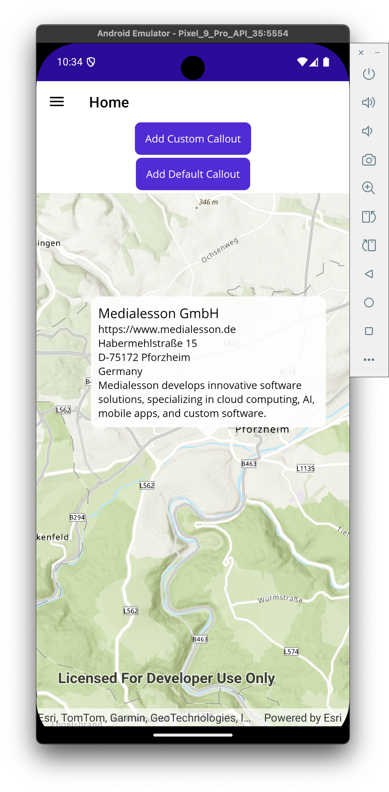

# 💬 Custom Callouts in ArcGIS Runtime SDK for .NET (MAUI/WPF)

This sample demonstrates how to implement **custom callouts** in an ArcGIS Runtime SDK for .NET (MAUI/WPF) application.

The default `CalloutDefinition` provided by Esri is quite limited when it comes to displaying larger or styled text. This project shows how to use a **custom control** to display extended information like company names, long addresses, and other details directly on the map.

## 📸 Preview



## 🧪 Features

- Custom `ContentView` as callout replacement
- Works in MAUI and WPF
- Handles long multi-line content gracefully
- Fully customizable using XAML and data binding

## 📦 Technologies

- [.NET MAUI](https://learn.microsoft.com/en-us/dotnet/maui/)
- [ArcGIS Runtime SDK for .NET](https://developers.arcgis.com/net/)
- C#, XAML

## 🚀 Usage

```csharp
// Create and show a custom callout
var calloutContent = new CustomCallout("Main Label", "Longer description or address text");
MapView.ShowCalloutAt(graphic.Geometry?.Extent?.GetCenter() ?? new MapPoint(0, 0), calloutContent);
```

📖 Related Blog Post
👉 💬 Custom Callouts in ArcGIS Runtime SDK for .NET (MAUI/WPF)

MIT — feel free to use, improve and contribute!

Made with ❤️ to solve real-world Esri Runtime limitations.